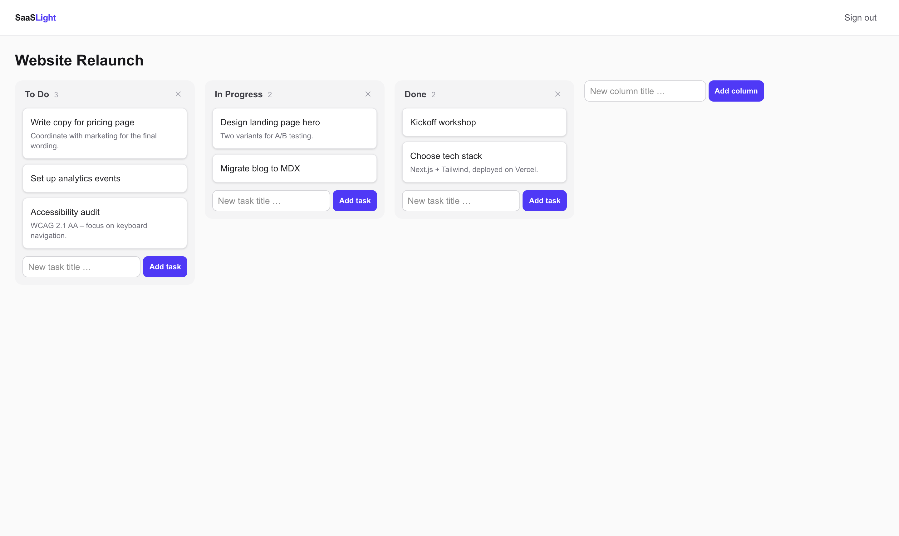
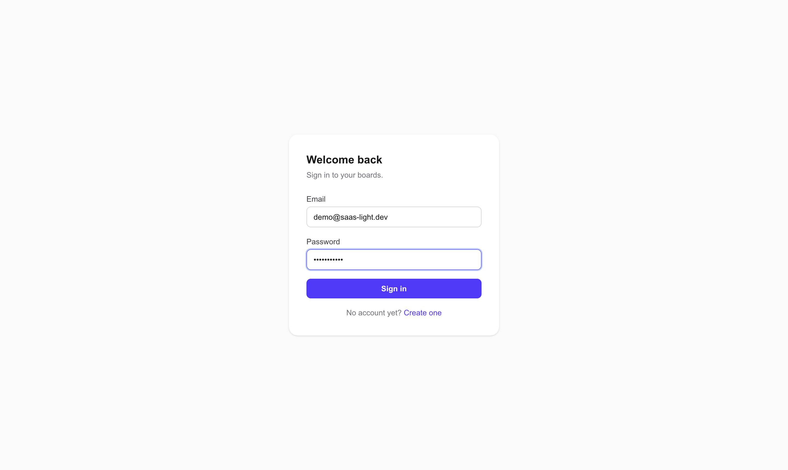
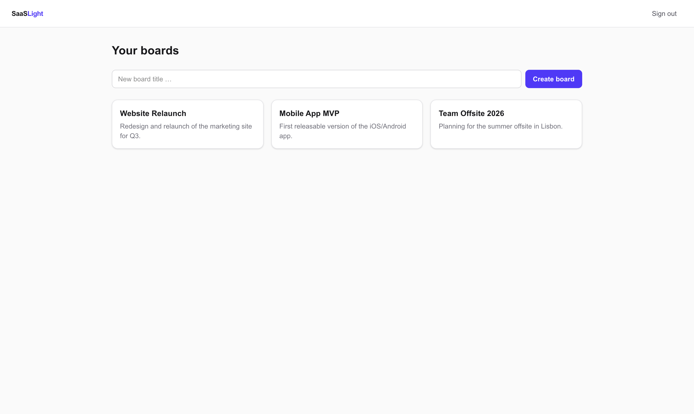
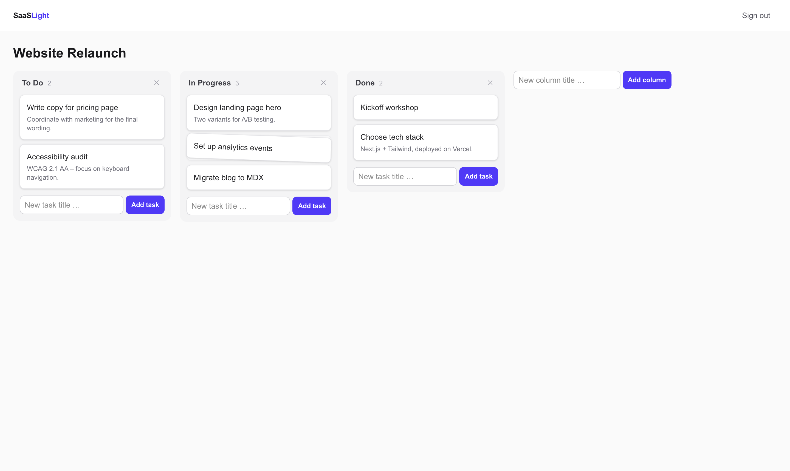

# Flowboard

A lightweight, full-stack project management tool — a minimal Trello-style app with
secure authentication, board management and a fluid drag & drop Kanban experience.

Built as a clean-architecture reference project with production-grade patterns:
strict TypeScript end to end, validated inputs, tested critical paths and a clear
separation between business logic and UI.



## Features

### 🔐 Secure authentication

Register, sign in and stay signed in — sessions are JWTs stored in **httpOnly
cookies**, so tokens are never readable from JavaScript (XSS-safe). Passwords are
hashed with bcrypt, login errors are deliberately generic to prevent account
enumeration, and every API route is guarded server-side.



### 📋 Board dashboard

Create, open and delete project boards. Every board is scoped to its owner —
foreign board IDs behave exactly like missing ones, so the API leaks nothing
about other users' data.



### 🖱️ Drag & drop task management

Organize tasks in columns and move them with smooth drag & drop (powered by
[dnd-kit](https://dndkit.com)). Cards show live insertion previews while
dragging across columns. Moves are applied **optimistically** for instant
feedback and rolled back automatically if the server rejects them — positions
are re-indexed transactionally on the backend so ordering never corrupts.



## Tech stack

| Layer     | Technology                                                        |
| --------- | ----------------------------------------------------------------- |
| Frontend  | Next.js (App Router), React 19, Tailwind CSS 4, dnd-kit, TypeScript |
| Backend   | Node.js, Express 5, TypeScript, Zod                                |
| Database  | PostgreSQL via Prisma ORM                                          |
| Auth      | JWT in httpOnly cookies, bcrypt password hashing                   |
| Testing   | Jest + Supertest (API), Jest + React Testing Library (UI)          |
| Tooling   | ESLint, Prettier, strict TypeScript in both repos                  |

## Architecture highlights

- **Feature modules** on the backend (`auth`, `boards`, `columns`, `tasks`), each
  split into router → service → Zod schemas. HTTP handlers stay thin; business
  logic lives in services.
- **Global error handling**: one middleware maps domain errors, validation
  errors and Prisma error codes to clean HTTP status codes (400/401/404/409),
  never leaking internals.
- **Ownership-scoped queries** everywhere — authorization is part of every
  database query, not an afterthought.
- **Transactional position bookkeeping** for drag & drop: moving a task closes
  the gap in the source column and makes room in the target column atomically.
- **32 automated tests** across both repos cover the critical paths: the full
  auth flow, board CRUD with ownership checks, the move algorithm
  (cross-column, clamping, foreign-board rejection) and the interactive Kanban
  UI including optimistic-update rollback.

## Repository layout

Monorepo with two independent applications:

```
.
├── backend/    # Express + Prisma API
├── frontend/   # Next.js app
└── docs/       # screenshots & assets for this README
```

## Quick start

Requirements: Node.js 20+, Docker (or any local PostgreSQL).

```bash
# 1. Database
docker run -d --name flowboard-pg \
  -e POSTGRES_PASSWORD=postgres -e POSTGRES_DB=flowboard \
  -p 5432:5432 postgres:16-alpine

# 2. Backend (terminal 1)
cd backend
npm install
cp .env.example .env            # defaults match the container above
npx prisma migrate dev
npm run dev                     # API on http://localhost:4000

# 3. Frontend (terminal 2)
cd frontend
npm install
cp .env.local.example .env.local
npm run dev                     # App on http://localhost:3000
```

Open http://localhost:3000, create an account and start organizing.

## Running the tests

```bash
cd backend && npm test     # 23 tests – auth, boards, task moves (DB mocked)
cd frontend && npm test    # 9 tests – forms, Kanban board, rollback behavior
```

## API overview

The full endpoint reference lives in [backend/README.md](backend/README.md).
Frontend architecture notes are in [frontend/README.md](frontend/README.md).
