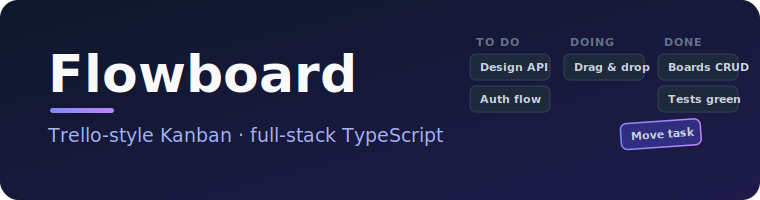
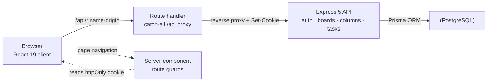

<p align="center">
  
</p>

<p align="center">
  <a href="https://flowboard-weld.vercel.app"></a>
  <a href="https://github.com/AdrianDeutsch/flowboard/actions/workflows/ci.yml"></a>
  <a href="LICENSE"></a>
  
  
  
  
  
</p>

<p align="center">
  
  <br><em>Drag &amp; drop Kanban board with live insertion previews and optimistic moves</em>
</p>

**Flowboard** is a lightweight, full-stack project management tool — a minimal Trello-style app with
secure authentication, board management and a fluid drag &amp; drop Kanban experience. It is built as a
clean-architecture reference project with production-grade patterns: strict TypeScript end to end,
validated inputs, tested critical paths and a clear separation between business logic and UI.

**🔗 Live demo: [flowboard-weld.vercel.app](https://flowboard-weld.vercel.app)** — create an account
and start organizing. The backend runs on a free tier that sleeps after inactivity, so the very first
request may take ~50 s to wake it.

---

## 📑 Table of contents

- [Highlights](#-highlights)
- [Features](#-features)
- [Architecture](#-architecture)
- [Tech stack](#-tech-stack)
- [Quick start](#-quick-start)
- [Running the tests](#-running-the-tests)
- [Deployment](#-deployment)
- [Project structure](#-project-structure)
- [API overview](#-api-overview)

---

## ⭐ Highlights

- **First-party auth cookies by design** — the frontend proxies the API through its own origin (BFF
  pattern), so the JWT lives in an httpOnly, `sameSite=lax`, `secure` cookie that is never readable
  from JavaScript and never treated as a blocked third-party cookie.
- **Optimistic drag &amp; drop with rollback** — moves apply instantly and are reverted automatically if
  the server rejects them; positions are re-indexed **transactionally** so ordering never corrupts.
- **Authorization in every query** — boards are ownership-scoped, so foreign IDs behave exactly like
  missing ones and the API leaks nothing about other users' data.
- **Tested critical paths** — 32 automated tests cover the full auth flow, board CRUD with ownership
  checks, the move algorithm (cross-column, clamping, foreign-board rejection) and the interactive
  Kanban UI including optimistic-update rollback.
- **Green CI &amp; deployed** — lint, test and build run for both apps on every push; the app is live on
  Vercel + Render + Neon.

---

## ✨ Features

| Area | Status | Technology |
|---|---|---|
| 🔐 Secure authentication | live | JWT in httpOnly cookies, bcrypt hashing, generic login errors |
| 📋 Board dashboard (CRUD) | live | Ownership-scoped Prisma queries |
| 🖱️ Drag &amp; drop Kanban | live | dnd-kit, optimistic updates, transactional re-indexing |
| 🛡️ Server-side route guards | live | Next.js server-component layouts (Node runtime) |
| ✅ Automated tests (32) | green in CI | Jest + Supertest (API), Jest + RTL (UI) |
| 🚀 CI/CD + live deploy | live | GitHub Actions, Vercel + Render + Neon |

### 🔐 Secure authentication

Register, sign in and stay signed in — sessions are JWTs stored in **httpOnly cookies**, so tokens are
never readable from JavaScript (XSS-safe). Passwords are hashed with bcrypt, login errors are
deliberately generic to prevent account enumeration, and every API route is guarded server-side.

<p align="center"></p>

### 📋 Board dashboard

Create, open and delete project boards. Every board is scoped to its owner — foreign board IDs behave
exactly like missing ones, so the API leaks nothing about other users' data.

<p align="center"></p>

### 🖱️ Drag &amp; drop task management

Organize tasks in columns and move them with smooth drag &amp; drop (powered by
[dnd-kit](https://dndkit.com)). Cards show live insertion previews while dragging across columns. Moves
are applied **optimistically** for instant feedback and rolled back automatically if the server rejects
them — positions are re-indexed transactionally on the backend so ordering never corrupts.

<p align="center"></p>

---

## 🏗 Architecture

The browser only ever talks to the Vercel origin. A catch-all route handler reverse-proxies `/api/*`
to the Express backend, preserving `Set-Cookie` so the auth cookie stays first-party. Route protection
runs in server-component layouts on the Node runtime — no edge middleware.



On the backend, each feature is a module split into **router → service → Zod schemas**: HTTP handlers
stay thin while business logic lives in services. One global error middleware maps domain, validation
and Prisma errors to clean HTTP status codes (400/401/404/409) without leaking internals.

---

## 🧰 Tech stack

| Layer     | Technology                                                          |
| --------- | ------------------------------------------------------------------- |
| Frontend  | Next.js 16 (App Router), React 19, Tailwind CSS 4, dnd-kit, TypeScript |
| Backend   | Node.js, Express 5, TypeScript, Zod                                 |
| Database  | PostgreSQL via Prisma ORM                                           |
| Auth      | JWT in httpOnly cookies, bcrypt password hashing                    |
| Testing   | Jest + Supertest (API), Jest + React Testing Library (UI)           |
| Tooling   | ESLint, Prettier, strict TypeScript, GitHub Actions CI              |
| Hosting   | Vercel (frontend) · Render (API) · Neon (PostgreSQL)                |

---

## 🚀 Quick start

Requirements: Node.js 20+, Docker (or any local PostgreSQL).

```bash
# 1. Database
docker run -d --name flowboard-pg \
  -e POSTGRES_PASSWORD=postgres -e POSTGRES_DB=flowboard \
  -p 5432:5432 postgres:16-alpine

# 2. Backend (terminal 1)
cd backend
npm install
cp .env.example .env            # defaults match the container above
npx prisma migrate dev
npm run dev                     # API on http://localhost:4000

# 3. Frontend (terminal 2)
cd frontend
npm install
cp .env.local.example .env.local
npm run dev                     # App on http://localhost:3000
```

Open http://localhost:3000, create an account and start organizing.

### Optional: enable the pre-push quality gate

A [`pre-push`](.githooks/pre-push) hook runs lint, tests and builds for both apps before every push.
Enable it once per clone:

```bash
git config core.hooksPath .githooks
```

---

## 🧪 Running the tests

```bash
cd backend && npm test     # 23 tests – auth, boards, task moves (DB mocked)
cd frontend && npm test    # 9 tests  – forms, Kanban board, rollback behavior
```

All 32 tests run in CI on every push via [GitHub Actions](.github/workflows/ci.yml).

---

## 🚢 Deployment

The frontend proxies all `/api/*` traffic to the backend through a catch-all route handler
([`app/api/[...path]/route.ts`](frontend/app/api/[...path]/route.ts)), so the browser only ever talks
to a single origin. This keeps the httpOnly auth cookie **first-party**, which is what makes
`sameSite=lax` stay valid once frontend and backend live on different hosts — and sidesteps
third-party-cookie blocking. Route protection runs in server-component layouts (Node runtime), not edge
middleware.

| Component | Host  | Notes                                              |
| --------- | ----- | -------------------------------------------------- |
| Frontend  | Vercel | Root directory `frontend/`, env `BACKEND_INTERNAL_URL` → backend URL |
| Backend   | Render | Blueprint in [`render.yaml`](render.yaml); runs `prisma migrate deploy` on each release |
| Database  | Neon  | PostgreSQL; connection string set as `DATABASE_URL` on Render        |

---

## 📁 Project structure

Monorepo with two independent applications:

```
.
├── backend/    # Express + Prisma API
│   └── src/
│       ├── modules/   # feature modules: auth · boards · columns · tasks
│       │              #   each: router → service → Zod schemas
│       ├── middleware/# auth guard, request validation, error handler
│       └── lib/       # Prisma client singleton
├── frontend/   # Next.js app (App Router)
│   ├── app/           # routes, server-component guards, /api proxy handler
│   ├── components/    # auth, boards, kanban, layout
│   └── lib/           # typed API client, shared types
└── docs/       # screenshots & assets for this README
```

---

## 📘 API overview

The full endpoint reference lives in [backend/README.md](backend/README.md).
Frontend architecture notes are in [frontend/README.md](frontend/README.md).

---

<p align="center"><sub>Built by Adrian Deutsch · MIT licensed</sub></p>
